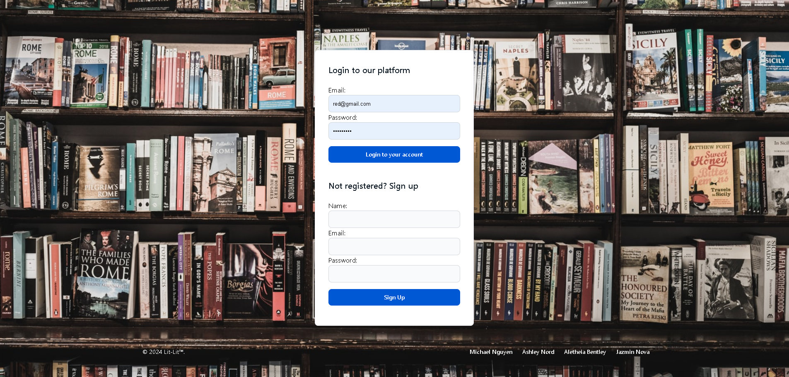
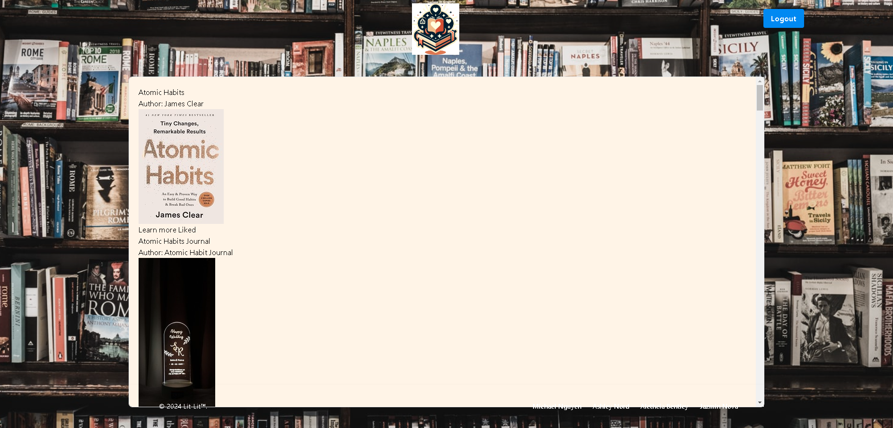

<div align="center">

  <!-- Add badges using the following format: -->
  <!-- (urlToGithubHere) -->

[](https://opensource.org/licenses/MIT)
[](https://github.com/a-nord/Lit-Lit/graphs/contributors)
[](https://github.com/a-nord/Lit-Lit/network/members)
[](https://github.com/a-nord/Lit-Lit/stargazers)
[](https://github.com/a-nord/Lit-Lit/issues)

</div>

<!-- PROJECT LOGO -->

<div align="center">
  <a href="https://github.com/a-nord/Lit-Lit">
    
  </a>
  
  <h3 align="center">Lit-Lit</h3>

  <p align="center">
    Social media app for the bookworm community to connect with each other and share book recommendations.    <br />
    <a href="https://github.com/a-nord/Lit-Lit"><strong>Explore Lit-Lit Docs »</strong></a>
    <br />
    <br />
    <!-- !!!IMPORTANT!!! add your deployment link here -->
    <a href="https://github.com/a-nord/Lit-Lit">View Demo(Broken)</a>
    ·
    <a href="https://github.com/a-nord/Lit-Lit/issues">Report Bug</a>
    ·
    <a href="https://github.com/a-nord/Lit-Lit/issues">Request Feature</a>

  </p>
</div>

<!-- TABLE OF CONTENTS -->
<details>
  <summary>Table of Contents</summary>
  <ol>
    <li>
      <a href="#about-the-project">About The Project</a>
      <ul>
        <li><a href="#built-with">Built With</a></li>
      </ul>
    </li>
    <li>
      <a href="#getting-started">Getting Started</a>
      <ul>
        <li><a href="#installation">Installation</a></li>
      </ul>
    </li>
    <li><a href="#usage">Usage</a></li>
    <li><a href="#roadmap">Roadmap</a></li>
    <li><a href="#contributing">Contributing</a></li>
    <li><a href="#license">License</a></li>
    <li><a href="#contact">Contact</a></li>
    <li><a href="#acknowledgments">Acknowledgments</a></li>
  </ol>
</details>

<!-- ABOUT THE PROJECT -->

## About The Project

This application is designed for the bookworm community to gather and connect. Users can create an account to access the app's features. You can search for the book you want to add information on, share your thoughts on it, recommend the book to your friends, and contribute any book you're currently reading to the database. Due to time constraints and development complications, many of our ideas will be incorporated into future updates.

Login or Creat an Account


Search Bar


Results Page


<!--  -->

### Built With

<div align="center">
This project was built using Express, Handlebars, mySQL2, sequelize, and tailwind css.

<!-- TODO -->

[](https://javascript.info/)
[](https://nodejs.org/en/)
[](https://expressjs.com/)
[](https://www.npmjs.com/)
[](https://code.visualstudio.com/docs)

</div>

<!-- GETTING STARTED -->

## Getting Started

Once completely built, this application will function as a deployed app on Heroku

### Local Installation / Testing

1. Clone the rep

```
git clone https://github.com/a-nord/Lit-Lit.git
```

2. Install dependencies

```
npm run install
```

3. Seed the database

```
npm run seed
```

4. Launch the app in development environments

```
npm run start
```

5. Visit:

[localhost://](
https://git.heroku.com/lit-lit.git)

<!-- USAGE EXAMPLES -->

## Usage

Once the app is functional, screenshots will be added in this section.

<!-- ROADMAP -->

## Roadmap

#### MVP

<!-- This is a nested check-box that displays a nice checked or unchecked list on your Github repo to show your visitor's a quick road map! -->

- [ ] Front End

  - [ ] User Auth
  - [ ] User Profile Page
    - [ ] Routing
    - [ ] Styling
  - [ ] Landing Page
    - [ ] Routing
    - [ ] Styling

- [ ] Back End
  - [ ] Models
  - [ ] Seeds
  - [ ] apiRouting
  - [ ] userRouting

#### Future Development

- [ ] Profile page to update personal information
- [ ] Share book recommendations
- [ ] Create group to make a book club
- [ ] Carousel that has a list of your liked/save books
- [ ] Comment of post of people and recommendations

See the [open issues](https://github.com/a-nord/Lit-Lit/issues) for a full list of proposed features (and known issues).

<!-- CONTRIBUTING -->

## Contributing

Contributions are what make the open source community such an amazing place to learn, inspire, and create. Any contributions you make are **greatly appreciated**.

If you have a suggestion that would make this better, please fork the repo and create a pull request. You can also simply open an issue with the tag "enhancement".
Don't forget to give the project a star! Thanks again!

1. Fork the Project
2. Create your Feature Branch (git checkout -b feature/Enhancements)
3. Commit your Changes (git commit -m 'Add some Enhancements')
4. Push to the Branch (git push origin feature/Enhancements)
5. Open a Pull Request

<!-- LICENSE -->

## License

This project is licensed under the MIT license.

See LICENSE.txt for more information.

<!-- CONTACT -->

## Contact

<!-- Add your name, portfolio link, and email if you would like here -->

[Altheia Bentley](https://github.com/Aricoria10) 

[Jazmin Nova](https://github.com/Jazminnova) 

[Michael Nguyen](https://github.com/MikeNguyen1092) 

[Ashley Nord](https://github.com/a-nord) 

Project Links:

[Github Repository](https://github.com/a-nord/Lit-Lit)

<!-- !!!IMPORTANT!!! add your deployment link here -->

[Deployment](
https://git.heroku.com/lit-lit.git)

<!-- ACKNOWLEDGMENTS -->

## Acknowledgments

Example MVC folder structure provided by 2u's Teacher's Assistant [Mary Elenius](https://maryelenius.com/d20)
